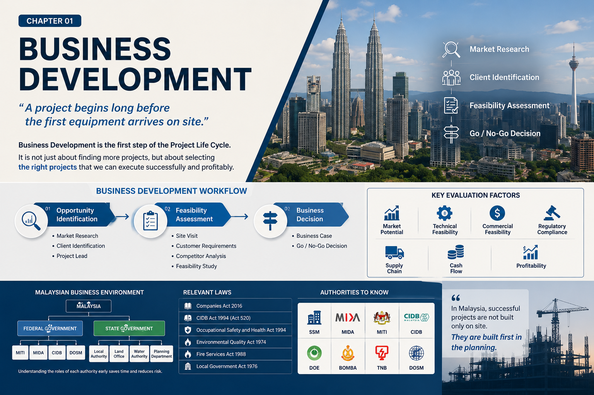
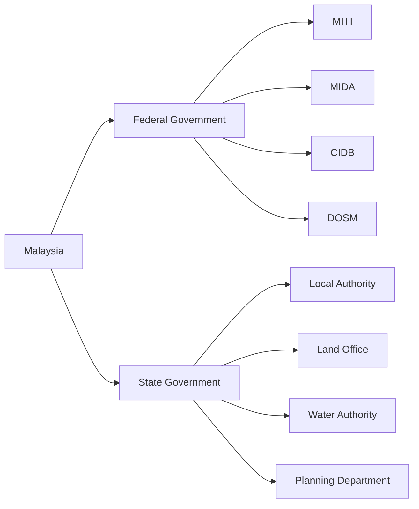
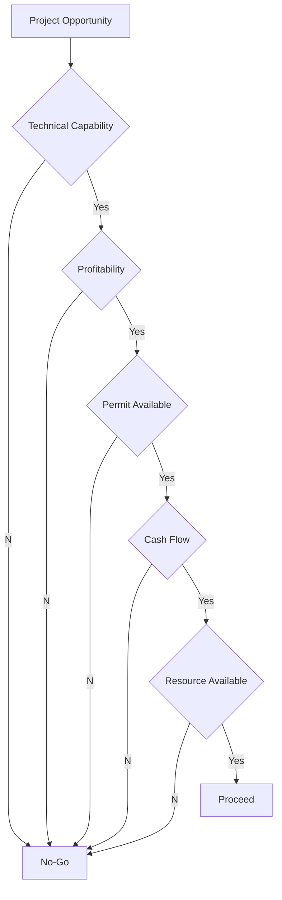

# Chapter 01. Business Development

> **"A project begins long before the first equipment arrives on site."**



> Successful projects begin long before construction starts. Business development is the first stage of the project life cycle, where market opportunities, technical and commercial feasibility, regulatory requirements, and business risks are evaluated before making a Go/No-Go decision.

---

# 1. Overview

사업 기회 발굴(Business Development)은 프로젝트 생애주기(Project Life Cycle)의 가장 첫 번째 단계이다. 많은 사람들이 프로젝트는 계약 체결이나 착공으로 시작된다고 생각하지만, 실제 프로젝트는 그보다 훨씬 이전부터 시작된다. 시장을 조사하고, 고객을 발굴하며, 사업성을 검토하고, 회사가 해당 프로젝트를 수행할 수 있는지 판단하는 과정이 모두 프로젝트의 일부이다.

말레이시아에서는 특히 사업 초기 단계의 검토가 중요하다. 건설 프로젝트라 하더라도 현장만 관리해서는 프로젝트를 성공적으로 수행하기 어렵다. 투자 환경, 정부 정책, 산업단지 개발계획, 인허가 체계, 현지 협력업체, 공급망, 인력 확보 가능성까지 함께 고려해야 한다.

사업 기회 발굴 단계에서 충분한 검토가 이루어지지 않으면 이후 입찰, 계약, 공정관리, 인허가, 원가관리, 준공 단계에서 예기치 않은 문제가 발생할 가능성이 높아진다.

---

# 2. Objectives

Business Development의 목적은 단순히 프로젝트를 많이 확보하는 것이 아니다.

가장 중요한 목적은 **회사가 성공적으로 수행할 수 있는 프로젝트를 선별하는 것**이다.

사업 기회 발굴 단계에서는 다음 사항을 종합적으로 판단한다.

- 시장성(Market Potential)
- 기술적 수행 가능성(Technical Feasibility)
- 상업적 타당성(Commercial Feasibility)
- 법규 적합성(Regulatory Compliance)
- 공급망(Supply Chain)
- 현금흐름(Cash Flow)
- 수익성(Profitability)

사업 개발은 영업(Sales)이 아니라 회사의 투자 의사결정을 위한 첫 번째 프로젝트 관리 활동이라고 볼 수 있다.

---

# 3. Applicable Projects

본 절차는 다음 프로젝트를 대상으로 한다.

| Project Type | Example |
|---------------|-----------------------------|
| Manufacturing Plant | Semiconductor, Chemical, Food Factory |
| Industrial Facility | Warehouse, Logistics Center |
| Power Project | Power Plant, Solar Farm |
| Infrastructure | Highway, Water Treatment |
| Commercial Building | Office, Data Center |
| Renewable Energy | Wind, Hydrogen |

---

# 4. Malaysian Business Environment

말레이시아는 연방국가(Federation)이다.

따라서 중앙정부와 주정부(State Government)가 서로 다른 권한을 가지고 있다.

프로젝트를 추진하기 전에 반드시 다음 사항을 이해해야 한다.



예를 들어 제조공장 프로젝트라면 MIDA의 투자 승인과 인센티브 제도를 확인해야 하며, 건설공사라면 CIDB 등록 여부를 검토해야 한다. 토지 개발과 건축 인허가는 해당 지방정부(Pihak Berkuasa Tempatan, PBT)의 권한에 속한다.

---

# 5. Relevant Laws

사업 기회를 검토하는 단계에서는 아직 계약이 체결되지 않았더라도 적용 가능한 법령을 미리 검토해야 한다.

| Regulation | Purpose |
|------------|--------------------------------|
| Companies Act 2016 | Company Formation |
| CIDB Act 1994 (Act 520) | Contractor Registration |
| Occupational Safety and Health Act 1994 | Safety Management |
| Environmental Quality Act 1974 | Environmental Compliance |
| Fire Services Act 1988 | Fire Safety |
| Local Government Act 1976 | Building Approval |

이러한 법령은 실제 프로젝트 수행 단계에서 적용되지만, 사업성 검토 단계부터 영향을 미친다.

예를 들어 CIDB 등록이 불가능한 회사라면 건설공사를 직접 수행할 수 없으며, 환경허가가 어려운 프로젝트라면 초기 사업성 자체를 다시 검토해야 한다.

---

# 6. Government Authorities

사업 기회 단계에서 미리 파악해야 하는 기관은 다음과 같다.

| Authority | Responsibility |
|------------|----------------|
| SSM | Company Registration |
| MIDA | Investment Promotion |
| MITI | Industrial Policy |
| CIDB | Construction Registration |
| DOE | Environmental Approval |
| BOMBA | Fire Safety |
| DOSM | Statistics |
| TNB | Electricity Supply |

이 기관들은 프로젝트 전 과정에서 반복적으로 등장한다. 따라서 사업 초기부터 각 기관의 역할과 승인 범위를 이해하면 이후 인허가와 계약 단계에서 시간을 줄일 수 있다.

---

# 7. Business Development Workflow

사업 기회 발굴은 일반적으로 **사업 기회 확인 → 사업성 평가 → 의사결정**의 세 단계로 진행된다. 실제 프로젝트에서는 단계가 반복되거나 일부 절차가 동시에 진행되기도 하지만, 기본적인 검토 흐름은 다음과 같다.

| Phase | 주요 활동 | 주요 산출물 |
|-------|-----------|------------|
| **① Opportunity Identification** | Market Research, Client Identification, Project Lead | Project Opportunity List |
| **② Feasibility Assessment** | Site Visit, Customer Requirements, Competitor Analysis, Feasibility Study | Feasibility Report |
| **③ Business Decision** | Business Case, Go / No-Go Decision | Business Case, Go / No-Go Report |

### 단계별 세부 절차

| 순서 | Activity | 주요 검토 내용 |
|------|----------|----------------|
| 1 | Market Research | 산업 동향, 투자 계획, 시장 규모 조사 |
| 2 | Client Identification | 발주처 및 의사결정 구조 파악 |
| 3 | Project Lead | 프로젝트 기본 정보 확보 |
| 4 | Site Visit | 현장 접근성, 기반시설, 주변 환경 확인 |
| 5 | Customer Requirements | 예산, 일정, 품질, 계약 조건 확인 |
| 6 | Competitor Analysis | 경쟁사, 수행실적, 가격 수준 분석 |
| 7 | Feasibility Study | 기술, 법규, 인허가, 원가, 일정 검토 |
| 8 | Business Case | 수익성 및 투자 타당성 분석 |
| 9 | Go / No-Go | 프로젝트 추진 여부 결정 |

실무에서는 이 과정이 반드시 순차적으로 진행되는 것은 아니다. 고객 미팅 이후 다시 시장조사를 수행하기도 하고, 현장조사 이후 원가를 다시 산출하는 경우도 많다.

따라서 Business Development는 반복적인 검토(Iterative Review)를 전제로 수행되어야 한다.

---

# 8. Market Research

## 시장조사는 프로젝트보다 시장을 먼저 이해하는 과정이다.

프로젝트를 처음 검토할 때 가장 먼저 해야 하는 일은 발주 정보를 찾는 것이 아니라 시장을 이해하는 것이다. 프로젝트는 시장에서 발생하며, 시장은 정부 정책과 산업 구조에 따라 계속 변화한다.

말레이시아는 제조업과 수출 중심 국가이며, 정부는 산업별로 다양한 투자 정책을 운영하고 있다. 따라서 단순히 공사 규모만 확인하기보다 앞으로 어느 산업이 성장하는지, 어느 지역에 투자가 집중되는지를 함께 분석해야 한다.

예를 들어 Penang은 반도체와 전기전자(E&E) 산업, Johor는 데이터센터와 물류산업, Selangor는 제조업과 산업시설, Sarawak은 에너지와 중공업 프로젝트가 지속적으로 증가하는 특징을 가지고 있다.

---

### Market Research Workflow

```mermaid

flowchart LR

Industry
-->

Location

-->

Government Policy

-->

Investment Trend

-->

Potential Client

-->

Business Opportunity
```

---

### 조사해야 할 주요 항목

| 분야 | 확인 내용 | 주요 정보원 |
|------|-----------|------------|
| 산업 | 성장산업, 투자규모 | MITI, MIDA |
| 경제 | GDP, 환율, 금리 | DOSM, Bank Negara Malaysia |
| 지역 | 산업단지, 물류, 항만 | State Government |
| 인프라 | 전력, 용수, 도로 | TNB, Air Authority |
| 경쟁 | 주요 EPC, Local Contractor | CIDB |
| 노동 | 외국인 노동자 정책 | Ministry of Human Resources |

---

### 지역별 주요 산업

| State | 주요 산업 |
|--------|----------------------------|
| Selangor | Manufacturing, Logistics, Data Center |
| Johor | Data Center, Logistics, Port |
| Penang | Semiconductor, Electronics |
| Negeri Sembilan | Manufacturing |
| Pahang | Chemical, Rare Earth, Heavy Industry |
| Sarawak | Petrochemical, Energy |
| Sabah | Oil & Gas, Infrastructure |

---

## 실무 TIP

시장조사는 "어디에 공사가 있는가"를 조사하는 업무가 아니다.

"향후 5년 동안 어느 산업이 성장하는가"를 먼저 확인하면 프로젝트는 자연스럽게 따라온다.

---

# 9. Client Identification

## 고객을 찾는 것이 아니라 의사결정 구조를 이해하는 것이다.

프로젝트에는 항상 여러 이해관계자가 존재한다.

발주처(Owner)가 계약을 직접 결정하는 경우도 있지만, Consultant, PMC(Project Management Consultant), EPC Contractor가 실제 의사결정을 수행하는 경우도 많다.

따라서 고객을 찾는다는 것은 회사 이름을 아는 것이 아니라 프로젝트의 의사결정 구조를 이해하는 과정이다.

---

### Client Structure

프로젝트에는 하나의 발주처만 존재하는 것이 아니라, 투자자부터 공급업체까지 여러 이해관계자가 참여한다. 프로젝트의 성격에 따라 일부 역할은 생략되거나 하나의 조직이 여러 역할을 수행하기도 한다.

| Level | Organization | 주요 역할 |
|:---:|----------------------|----------------------------------------------|
| 1 | **Owner** | 프로젝트 투자 및 최종 의사결정 |
| 2 | **PMC (Project Management Consultant)** | 프로젝트 총괄 관리 및 발주처 지원 |
| 3 | **Consultant** | 설계, 기술 검토 및 감리 |
| 4 | **Main Contractor** | 시공 및 계약 관리 |
| 5 | **Subcontractor** | 전문 공종 시공 |
| 6 | **Supplier** | 자재 및 장비 공급 |
---

### 확인해야 할 사항

| 항목 | 설명 |
|------|------|
| Owner | 최종 투자자 |
| Consultant | 설계 및 기술검토 |
| PMC | 프로젝트 관리 |
| Main Contractor | 시공 총괄 |
| Procurement Team | 구매 담당 |
| Operation Team | 운영 담당 |

---

### 고객 미팅에서 확인할 내용

- 프로젝트 목적
- 예상 투자금액
- 목표 준공일
- Budget
- 계약 방식
- 발주 일정
- 주요 위험요인
- 향후 추가 프로젝트

---

## 실무 TIP

첫 번째 미팅에서 계약을 따내려고 하지 않는다.

프로젝트가 어떻게 결정되는지를 이해하는 것이 우선이다.

---

# 10. Customer Requirements Analysis

## 고객은 도면보다 결과를 원한다.

발주처는 도면을 원하는 것이 아니라 프로젝트의 성공을 원한다.

따라서 요구사항 분석은 Specification을 읽는 업무가 아니라 고객의 성공조건(Critical Success Factor)을 이해하는 과정이다.

실제로 같은 공장이라도 어떤 회사는 공기(Schedule)를 가장 중요하게 생각하고, 다른 회사는 품질(Quality)을 우선한다.

---

### Requirement Analysis

```mermaid
mindmap
root((Customer))

Budget

Schedule

Quality

Safety

Operation

Maintenance

Expansion
```

---

### 주요 확인사항

| 항목 | 실무 검토사항 |
|------|----------------|
| Scope | 공사범위 |
| Schedule | 목표 준공일 |
| Budget | 예산 |
| Contract | 계약조건 |
| Design | 설계책임 |
| Permit | 인허가 |
| Operation | 운영조건 |
| Maintenance | 유지관리 |

---

## Requirement Priority Matrix

| Priority | 예시 |
|-----------|-------------------------|
| High | Safety, Schedule |
| Medium | Cost, Quality |
| Low | Appearance |

---

## 실무 TIP

견적서를 작성하기 전에

"고객이 무엇을 가장 걱정하는가?"

를 먼저 이해하면 제안서의 방향이 달라진다.

---

# 11. Competitor Analysis

## 경쟁사는 가격보다 구조를 분석해야 한다.

말레이시아에서는 다양한 국가의 기업이 경쟁한다.

- Local Contractor
- Malaysian G7 Contractor
- Korean EPC
- Japanese Contractor
- Chinese EPC
- European Contractor

가격 경쟁력만 비교해서는 프로젝트를 이해하기 어렵다.

---

### Competitor Analysis Framework

```mermaid
flowchart LR

Company

-->

Experience

-->

Technical Capability

-->

Financial Capability

-->

Local Network

-->

Competitive Position
```

---

### 경쟁사 비교

| 구분 | Local | Korean | Chinese | Global EPC |
|------|--------|---------|-----------|------------|
| 가격 | ◎ | ○ | ◎ | △ |
| 품질 | ○ | ◎ | ○ | ◎ |
| 현지 네트워크 | ◎ | △ | ○ | ○ |
| 수행실적 | ○ | ◎ | ○ | ◎ |
| 금융 | △ | ○ | ◎ | ◎ |

---

### 경쟁사 조사 자료

- CIDB Contractor Search
- 회사 Annual Report
- LinkedIn
- Project Reference
- Industry News
- MIDA Investment News

---

## 실무 TIP

경쟁사를 이기는 방법은

가격을 낮추는 것이 아니라

**경쟁사가 하지 못하는 가치를 제안하는 것이다.**


---

# 12. Project Feasibility Study

## 프로젝트의 성공 가능성은 착공 전에 대부분 결정된다

프로젝트 타당성 검토(Project Feasibility Study)는 사업 기회를 실제 프로젝트로 추진할 수 있는지를 판단하는 과정이다. 단순히 "공사가 가능한가"를 검토하는 것이 아니라, 회사의 기술력과 자원, 계약 조건, 법적 규제, 공급망, 재무 상태를 종합적으로 평가하여 사업 추진 여부를 결정한다.

프로젝트가 수익성이 있어 보이더라도 인허가를 받을 수 없거나, 장비를 확보하지 못하거나, 현금흐름을 감당할 수 없다면 실제 수행은 어렵다. 따라서 타당성 검토는 기술 부서만의 업무가 아니라 영업, 계약, 구매, 재무, 현장 운영이 함께 참여해야 하는 의사결정 과정이다.

---

### Project Feasibility Framework

```mermaid
flowchart TB

Project Feasibility

--> Technical

Project Feasibility

--> Commercial

Project Feasibility

--> Regulatory

Project Feasibility

--> Procurement

Project Feasibility

--> Resource

Project Feasibility

--> Financial

Project Feasibility

--> Schedule
```

---

### 타당성 검토 항목

| 구분 | 주요 검토 내용 |
|------|----------------|
| Technical Feasibility | 공법, 설계, 시공성, 장비 |
| Commercial Feasibility | 계약조건, 수익성, 지급조건 |
| Regulatory Feasibility | CIDB, DOE, BOMBA, 지방정부 승인 |
| Procurement Feasibility | 장비 및 자재 조달 가능성 |
| Resource Feasibility | 인력, 협력업체, 전문기술자 확보 |
| Financial Feasibility | 현금흐름, 자금조달 |
| Schedule Feasibility | 공기, Long Lead Item, 우기 |

---

### 기술적 타당성 (Technical Feasibility)

기술적 타당성은 회사가 해당 프로젝트를 수행할 수 있는 기술과 경험을 가지고 있는지를 평가하는 과정이다.

다음 사항을 검토한다.

- 공법의 적합성
- 설계 난이도
- 주요 장비 확보
- 특수공법 필요 여부
- QA/QC 요구수준
- 시운전(Commissioning) 요구사항

---

### 법규 및 인허가 타당성 (Regulatory Feasibility)

말레이시아 프로젝트는 기술보다 인허가 일정이 공정을 좌우하는 경우가 많다.

사업 초기부터 다음 사항을 검토한다.

| 기관 | 검토 내용 |
|------|-----------|
| CIDB | Contractor Registration |
| DOE | Environmental Approval |
| BOMBA | Fire Approval |
| Local Authority | Development Order / Building Plan |
| TNB | Power Supply |
| Water Authority | Water Connection |

---

### 공급망 타당성 (Procurement Feasibility)

공급망은 공사기간에 직접적인 영향을 준다.

특히 다음 품목은 Long Lead Item 여부를 확인한다.

- Structural Steel
- Transformer
- Switchgear
- Generator
- HVAC Equipment
- Fire Pump
- Elevator
- Process Equipment

---

## 실무 TIP

Long Lead Item은 계약 체결 후 구매하는 것이 아니라 사업성 검토 단계부터 납기를 확인해야 한다.

---

# 13. Business Case

## 사업성은 수익보다 지속 가능성을 판단하는 과정이다.

Business Case는 프로젝트를 수행해야 하는 이유를 설명하는 내부 의사결정 문서이다.

사업성 검토에서는 예상 매출보다 프로젝트 전체의 재무 구조를 먼저 검토해야 한다.

---

### Business Case 구성

Business Case는 프로젝트의 사업성을 종합적으로 평가하기 위한 내부 의사결정 자료이다. 수익성만 검토하는 것이 아니라 예상 매출, 원가, 현금흐름, 주요 리스크, 투자수익률 등을 함께 분석하여 프로젝트 추진 여부를 판단한다.

| 평가 항목 | 주요 검토 내용 | 실무 검토 포인트 |
|-----------|----------------|------------------|
| **Revenue** | 예상 계약금액 및 추가 매출 | Variation Order, Escalation 가능성 |
| **Cost** | 직접공사비, 간접비, 일반관리비 | 원가 산출의 정확성 |
| **Cash Flow** | 월별 현금 유입·유출 | 선급금, 기성금, Retention, 운전자금 |
| **Risk** | 계약, 인허가, 공급망, 환율 등 | Risk Register 작성 |
| **ROI** | 투자수익률(Return on Investment) | 투자 대비 기대 수익 |
| **Decision** | Go / No-Go | 사업 추진 여부 최종 결정 |

Business Case는 단순한 수익 계산서가 아니다. 프로젝트 수행 과정에서 발생할 수 있는 기술적, 상업적, 법적, 재무적 위험을 함께 검토하고, 회사의 투자 전략과 자원 활용 계획을 종합적으로 판단하는 의사결정 자료로 활용된다.

### 주요 검토 항목

| 항목 | 설명 |
|------|------|
| Revenue | 예상 매출 |
| Direct Cost | 직접공사비 |
| Indirect Cost | 간접비 |
| Overhead | 본사관리비 |
| Cash Flow | 월별 자금 흐름 |
| Profit Margin | 예상 이익률 |
| ROI | 투자수익률 |
| Risk | 주요 리스크 |

---

### Cash Flow 검토

말레이시아 프로젝트에서는 대부분 초기 지출이 먼저 발생한다.

대표적인 현금흐름은 다음과 같다.

```mermaid
flowchart LR

Contract Award

-->

Advance Payment

-->

Material Purchase

-->

Construction

-->

Progress Claim

-->

Retention

-->

Final Account
```

실무에서는 흑자 프로젝트라도 현금흐름이 부족하여 어려움을 겪는 사례가 적지 않다. 따라서 Business Case에서는 Profit보다 Cash Flow를 먼저 검토하는 것이 일반적이다.

---

# 14. Go / No-Go Decision

## 좋은 프로젝트를 선택하는 것이 좋은 프로젝트를 수행하는 것보다 중요하다.

모든 프로젝트를 입찰하는 것은 좋은 전략이 아니다.

Go / No-Go는 회사의 자원을 가장 효과적으로 사용할 수 있는 프로젝트를 선택하기 위한 절차이다.

---

### Decision Process



---

### Go 판단 기준

- 기술적으로 수행 가능하다.
- 수익성이 확보된다.
- 현금흐름을 감당할 수 있다.
- 인허가가 가능하다.
- 일정이 현실적이다.
- 인력과 장비 확보가 가능하다.

---

### No-Go 판단 기준

- Scope가 명확하지 않다.
- 계약조건이 불리하다.
- 현금흐름 위험이 크다.
- 수행 경험이 부족하다.
- 인허가 가능성이 낮다.
- 회사 전략과 맞지 않는다.

---

# 15. Deliverables

사업 기회 발굴 단계에서 일반적으로 작성하는 문서는 다음과 같다.

| 문서 | 목적 |
|------|------|
| Project Lead Summary | 프로젝트 개요 |
| Client Meeting Minutes | 고객 미팅 기록 |
| Market Research Report | 시장조사 |
| Site Visit Report | 현장조사 |
| Competitor Analysis | 경쟁사 분석 |
| Preliminary Cost Estimate | 개략 견적 |
| Project Risk Register | 리스크 관리 |
| Business Case | 사업성 검토 |
| Go / No-Go Report | 의사결정 |

---

# 16. Business Development Checklist

| 구분 | 확인 | 완료 |
|------|------|------|
| 시장조사 | □ | |
| 고객분석 | □ | |
| 경쟁사 조사 | □ | |
| 법규 검토 | □ | |
| 인허가 검토 | □ | |
| 공급망 검토 | □ | |
| 원가 검토 | □ | |
| 현금흐름 검토 | □ | |
| 리스크 검토 | □ | |
| Go / No-Go | □ | |

---

# 17. References

| 기관 | 내용 |
|------|------|
| SSM | Company Registration |
| MIDA | Investment Promotion |
| MITI | Industrial Policy |
| CIDB | Contractor Registration |
| DOSM | Statistics |
| DOE | Environmental Approval |
| BOMBA | Fire Approval |
| TNB | Electricity Supply |

---

# 18. Chapter Summary

사업 기회 발굴은 프로젝트 생애주기(Project Life Cycle)의 첫 번째 단계이며, 이후 회사 설립, 입찰, 계약, 인허가, 조달, 시공, 준공에 이르는 모든 과정의 방향을 결정한다. 이 단계에서 수행한 시장조사와 사업성 검토 결과는 프로젝트 추진 여부를 판단하는 핵심 자료가 된다.

## 핵심 절차 요약

| 단계 | 주요 활동 | 주요 산출물 |
|------|-----------|------------|
| 1 | Market Research | Market Research Report |
| 2 | Client Identification | Client List, Meeting Record |
| 3 | Project Lead | Opportunity Summary |
| 4 | Site Visit | Site Visit Report |
| 5 | Customer Requirements | Requirement Analysis |
| 6 | Competitor Analysis | Competitor Analysis Report |
| 7 | Project Feasibility Study | Feasibility Study Report |
| 8 | Business Case | Business Case |
| 9 | Go / No-Go Decision | Go / No-Go Report |
| 10 | Tender Preparation | Tender Strategy |

---

## 핵심 체크포인트

| 구분 | 확인 사항 |
|------|-----------|
| 시장 | 산업 성장성과 투자 동향을 확인하였다. |
| 고객 | 발주처와 의사결정 구조를 파악하였다. |
| 경쟁 | 주요 경쟁사와 경쟁 환경을 분석하였다. |
| 기술 | 수행 가능한 기술과 자원을 검토하였다. |
| 법규 | 적용 법령과 인허가 요건을 검토하였다. |
| 원가 | 예상 공사비와 사업성을 분석하였다. |
| 재무 | 현금흐름과 자금 조달 계획을 검토하였다. |
| 의사결정 | Go / No-Go 판단을 완료하였다. |

---

## 다음 장 안내

다음 장에서는 말레이시아에서 프로젝트를 수행하기 위한 첫 번째 실무 단계인 **회사 설립(Company Setup)** 절차를 다룬다. 회사 형태 선정부터 SSM 등록, Company Secretary 선임, 법인 설립 완료까지 실제 업무 흐름을 중심으로 설명한다.
사업 기회 발굴은 프로젝트 생애주기의 첫 단계이며, 이후 회사 설립, 계약, 인허가, 조달, 시공, 준공에 이르는 모든 과정의 방향을 결정한다. 말레이시아에서는 특히 투자 환경, 법규, 정부기관, 공급망, 현금흐름을 초기부터 함께 검토해야 한다. 성공적인 프로젝트는 착공 이후의 관리보다, 착공 이전의 올바른 의사결정에서 시작된다는 점을 항상 염두에 둘 필요가 있다.