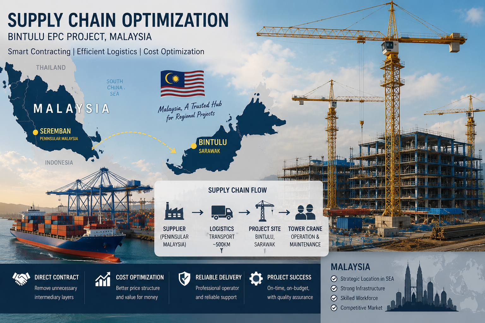

## Contract Structure Can Reduce Project Cost More Than Price Negotiation

*Figure 1. In EPC projects, project cost is often influenced more by contract structure, equipment ownership, logistics, and risk allocation than by unit rates alone.*

프로젝트를 수행하다 보면 같은 Tower Crane Operator 용역인데도 업체마다 견적 차이가 크게 나는 경우를 종종 경험합니다. 처음에는 단순히 인건비 차이로 생각하기 쉽지만, 실제 계약을 검토해 보면 장비 소유(Equipment Ownership), 물류(Logistics), 현장 관리(Overhead), 위험 분담(Risk Allocation) 등 다양한 요소가 함께 반영되어 있는 경우가 많습니다.

말레이시아 Bintulu EPC 프로젝트에서도 비슷한 경험이 있었습니다. 현지에서 받은 제안은 일반적인 시장 가격보다 높은 수준이었지만, 계약 구조를 조금 다른 관점에서 검토해 보니 공급 방식 자체를 변경할 수 있는 여지가 있었습니다. Tower Crane 장비는 발주처 또는 EPC에서 직접 제공하고, 공급사는 Operator와 운영 서비스(Operation Service)에 집중하도록 계약 범위를 구분했습니다. 또한 Peninsular Malaysia의 전문 업체와 직접 계약하는 방식을 검토하면서 공급 단계를 단순화했습니다.

그 결과 계약 금액은 기존 제안보다 상당한 수준으로 낮아졌습니다. 물론 이러한 결과를 단순히 "중간상이 많아서 비쌌다"고 해석하기는 어렵습니다. 지역 특성에 따른 물류비, 장비 투자비, 금융비용, 현장 지원 조직, 공급 리스크 등도 계약금액에 함께 반영될 수 있기 때문입니다. 다만 이번 사례를 통해 느낀 점은 가격 협상보다 먼저 계약 구조를 분석하는 것이 더 중요하다는 것이었습니다. 누가 장비를 제공하는지, 누가 유지관리를 담당하는지, 물류와 현장 지원을 어느 계약에 포함할 것인지에 따라 동일한 서비스라도 계약 금액은 상당히 달라질 수 있습니다. 

프로젝트마다 정답은 다를 수 있습니다. 하지만 Procurement와 Commercial Management 관점에서는 가장 저렴한 견적을 선택하는 것보다 프로젝트 특성에 맞는 공급 구조(Supply Chain Structure)를 설계하는 것이 장기적으로 더 큰 가치를 만드는 경우도 적지 않습니다.

#Procurement #SupplyChain #CommercialManagement #ContractManagement #EPC #Construction #ProjectManagement #QuantitySurveying