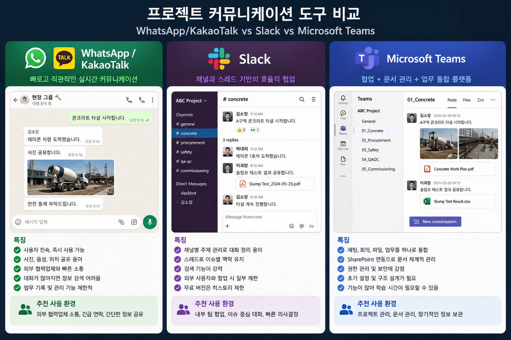

최근 Microsoft Teams를 사용할 기회가 있었는데, 프로젝트 커뮤니케이션 방식이 많이 달라지고 있다는 것을 느꼈습니다.

*Figure 1. Communication in modern construction projects is evolving from simple messaging toward integrated collaboration across people, documents, schedules, and project data.*

예전에는 카카오톡(KakaoTalk)과 WhatsApp만으로도 대부분의 현장 업무를 처리했습니다. 자재를 주문하고, 현장 사진을 공유하고, 콘크리트 타설 시간을 조율하는 데는 지금도 매우 편리한 도구입니다. 다만 프로젝트 규모가 커질수록 하루에도 수백 건의 메시지가 오가고, 중요한 질문이나 지시사항이 대화 속에 묻히는 경우도 종종 있었습니다.

Slack은 또 다른 방식이었습니다. 채널(Channel)과 스레드(Thread)를 중심으로 대화가 이어지기 때문에 하나의 이슈를 끝까지 따라가기 쉬웠고, 여러 사람이 동시에 협업하는 환경에서는 상당히 효율적으로 느껴졌습니다.

Teams를 사용하면서는 조금 다른 점이 눈에 들어왔습니다. 채팅 자체보다 프로젝트와 관련된 사진, 파일, 회의 내용이 함께 관리된다는 점이 인상적이었습니다. 현장에서 공유한 자료가 문서와 함께 연결되고, 시간이 지난 뒤에도 필요한 내용을 다시 찾아보기 쉬운 구조라는 점은 프로젝트 업무와 잘 어울린다는 생각이 들었습니다.

프로젝트가 복잡해질수록 커뮤니케이션도 단순히 메시지를 주고받는 수준을 넘어, 업무의 흐름과 기록을 함께 관리하는 방향으로 조금씩 변화하고 있는 것 같습니다.

#ProjectManagement #MicrosoftTeams #Collaboration #Construction #DigitalTransformation
