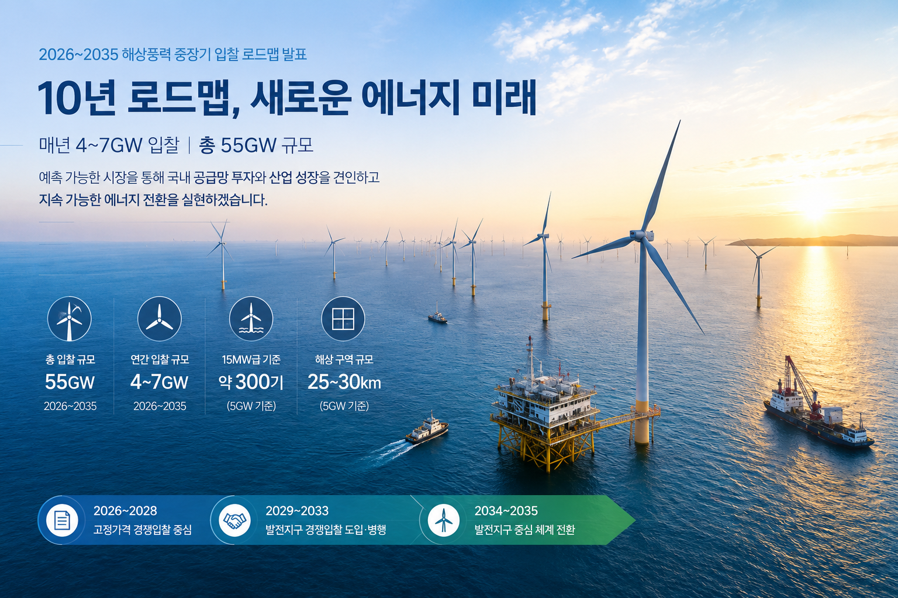

오늘 기후에너지환경부는 '해상풍력 중장기 입찰 로드맵'을 발표했습니다. 이번 발표는 2035년까지 적용될 최초의 10년 단위 해상풍력 중장기 입찰 로드맵으로 핵심 내용은 2026년부터 2035년까지 매년 4~7GW 규모, 총 55GW의 해상풍력 입찰을 추진한다는 것입니다. 

*Figure 1. Estimated annual investment required over the next ten years based on the government's offshore wind power roadmap. The values represent preliminary engineering and market-based estimates intended to illustrate the scale of capital investment throughout the implementation period.*

프로젝트를 수행하는 입장에서 가장 먼저 떠오른 것은 숫자입니다. 기본 계산으로 보면 5GW 해상풍력은, 15MW급 풍력터빈 약 300기, 약 25km × 25km 규모의 해역, 현재 시세 기준 매년 약 20조 원 이상이 필요한 프로젝트입니다. 여기에 해상변전소, 해저케이블, 계통연계, 항만, 설치선박, 유지보수 인프라까지 포함하면 하나의 거대한 산업 생태계가 로드맵에 따라 개발되고 움직이게 됩니다. 

중요한 것은 이러한 규모의 사업이 10년 동안 반복적으로 시장에 나오게 됨에 따라 해상풍력 공급망으로 터빈 제조사도, 하부구조물 제작사도, 해저케이블 업체도, 설치선사도 장기적인 입찰 계획에 따라 공장 증설과 장비 투자, 전문 인력 확보, 금융 조달 예측 가능성을 시장에 제공했다는 점에서 의미가 있습니다.

물론 55GW 입찰이 곧 55GW 준공을 의미하는 것은 아닙니다. 실제 사업은 주민과 어업인의 수용성, 군 작전 협의, 환경영향평가, 계통접속, 금융조달, 공급망 확보, EPC 수행이라는 긴 과정을 거쳐야 합니다. 결국 산업의 신뢰는 발표가 아니라 실제 착공과 준공을 통해 만들어질 것입니다.

그럼에도 오늘 발표는 분명한 출발점이라고 생각합니다. 프로젝트 관리(Project Management), EPC, 공급망(Supply Chain), 항만(Logistics), 전력망(Grid), 계약관리(Contract Management), 시운전(Commissioning), 운영 및 유지관리(Operation & Maintenance)까지 다양한 분야에서 새로운 기회가 열릴 가능성이 커졌습니다.

앞으로 10년은 단순히 풍력발전기를 더 세우는 시간이 아니라, 대한민국 해상풍력 산업의 기반을 구축하는 시간이 될 것입니다. 프로젝트를 수행하는 사람의 입장에서도 매우 의미 있는 로드맵으로 보입니다.

#OffshoreWind #OffshoreWindPower #RenewableEnergy #EnergyTransition #EnergyInfrastructure #ProjectManagement #EPC #SupplyChain #PowerGrid #Transmission #FloatingWind #EnergyPolicy #NetZero #Korea #Infrastructure
#해상풍력 #에너지전환 #재생에너지 #전력망 #프로젝트관리 #EPC #공급망 #인프라 #탄소중립 #해상풍력로드맵